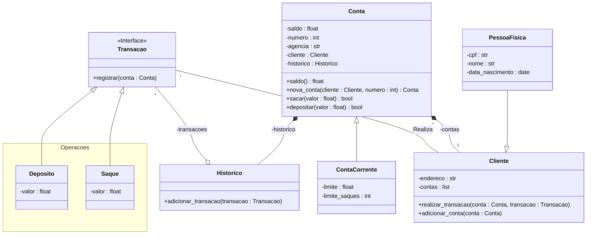

# **SISTEMA BANCÁRIO**
Desafio de Projeto do Bootcamp Python AI Backend Developer

## 💲v3.0
Objetivos:
- **Parte 1**
    - Atualizar a implementação do sistema bancário, para armazenar os dados de clientes e contas bancárias em objetos através de dicionários.
    - O código deve seguir o modelo de classes UML representado abaixo:

- **Parte 2**
    - Após concluir a modelagem das classes e a criação dos métodos, atualizar os métodos que tratam as opções do menu, para funcionarem com as classes modeladas.

## 💲v2.0
Objetivos:
- **Refatorar as operações** separando-as em funções distintas.
    - Depositar
    - Sacar
    - Extrato 

- **Criar novas funções**
    - Cadastrar Usuário (cliente)
    - Cadastrar Conta Corrente (vinculando-a com o usuário)

- **Regras de Negócio**
    - Saque:
        - A função de Saque deve receber os argumentos apenas por keyrowd-only.
        - Argumentos obrigatórios   : saldo, valor, extrato, limite, numero_saques, limite_saques
        - Retornos obrigatórios     : saldo e extrato

    - Depósito:
        - A função de Depósito deve receber os argumentos apenas por positional-only.
        - Argumentos obrigatórios   : saldo, valor, extrato 
        - Retornos obrigatórios     : saldo e extrato

    - Extrato:
        - A função de Extrato deve receber os argumentos por positional-only e também por keyrowd-only.
        - Argumentos posicionais    : saldo 
        - Argumentos nomeados       : extrato
- **Novas Funções**
    - Criar usuário(cliente):
        - Todos os usuários devem ser armazenados em uma lista
        - Usuários são compostos por: nome, data de nascimento, cpf e endereço
        - Endereço = logradouro, n° - bairro, cidade/sigla do estado
        - CPF deve ser armazenado somente números (sem ponto e sem hífen)
        - Não será permitida duplicidade de CPF (msg de erro "usuário já cadastrado")
    - Criar conta-corrente:
        - Todas as contas devem ser armazenadas em uma lista
        - Uma conta é composta por: agência, n° da conta e usuário
        - O número da conta é sequencial, iniciado em 1.
        - O número da agência é fixo: "0001"
        - O cliente pode ter N contas, mas uma conta pertence apenas a 1 usuário
        - Vínculo Conta -> usuário:
        - Realize o vínculo entre CC e cliente, preferencialmente filtrando a lista de usuários buscando pelo seu CPF

## 💲v1.0
Desenvolver um Sistema Bancário simples, somente com as operações:

- **Deposito**
    - Deve ser possível depositar apenas valores inteiros e positivos
    - Todos os depósitos devem ser armazenados em uma variável e exibidos na operação *extrato*

- **Saque**
    - Deve permitir 3 saques diários com limite máximo de $500.00
    - Caso o usuário não tenha saldo em conta, o sistema deverá exibir uma mensagem informando que não será possível sacar o valor por falta de saldo.

- **Extrato**
    - Valores devem ser exibidos no padrão R$xxxx.xx
    - Deve listar as operações de deposito e saque individualmente identificando seu tipo e mostrando o valor
    - Deve exibir o saldo atual
