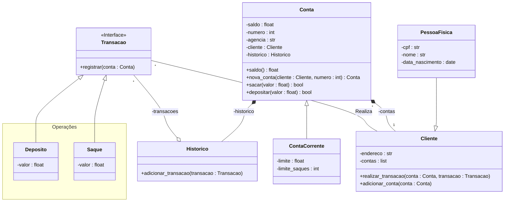

```mermaid
classDiagram
    Conta *-- "1" Historico : -historico
    Conta <|-- ContaCorrente
    PessoaFisica --|> Cliente
    Conta "*" *-- "1" Cliente : -contas 
    Transacao "*" -- Cliente : Realiza
    Transacao "*" --o Historico : -transacoes
    Transacao <|-- Deposito
    Transacao <|-- Saque

    class Conta{
        -saldo : float
        -numero : int
        -agencia : str
        -cliente : Cliente
        -historico : Historico
        +saldo() float
        +nova_conta(cliente : Cliente, numero : int) Conta
        +sacar(valor : float) bool
        +depositar(valor : float) bool
    }

    class ContaCorrente{
        -limite : float 
        -limite_saques : int
    }
    class PessoaFisica{
        -cpf : str
        -nome : str
        -data_nascimento : date
    }
    namespace Operações{

        class Deposito{
            -valor : float
        }
        class Saque{
            -valor : float
        }
    }
    
    class Cliente{
        -endereco : str
        -contas : list
        +realizar_transacao(conta : Conta, transacao : Transacao)
        +adicionar_conta(conta : Conta)
    }
    class Historico{
        +adicionar_transacao(transacao : Transacao)
    }
    class Transacao{
        <<Interface>>
        +registrar(conta : Conta)
    }

```